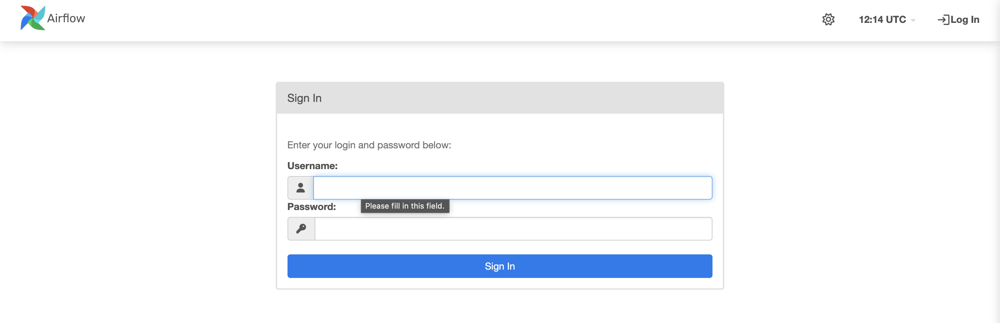
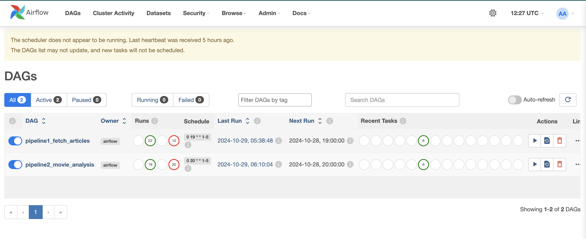
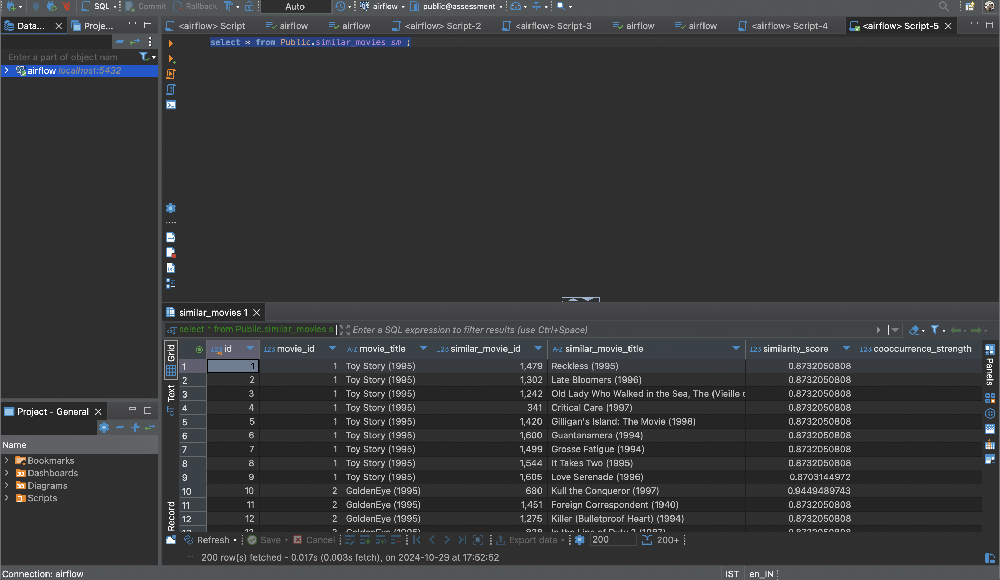
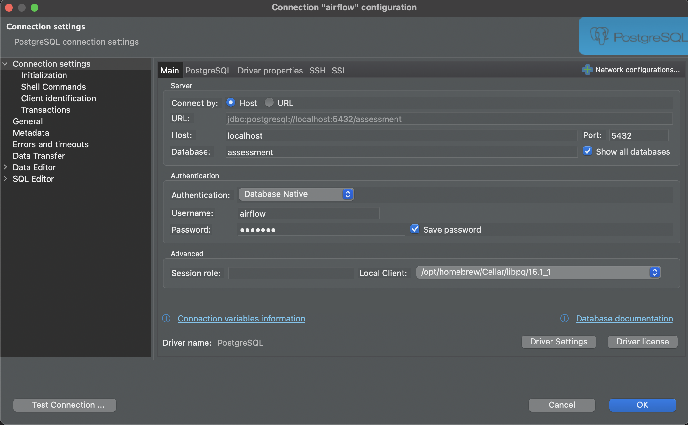

# SentimentStream

A Docker-based Apache Airflow pipeline suite for analyzing sentiment data from articles and movies. This project includes:

- **Pipeline 1**: Scrapes articles on HDFC and Tata Motors, finds sentiment scores of those articles, and stores results in Postgres.
- **Pipeline 2**: Analyzes the MovieLens dataset (executes if Pipeline 1 completes successfully on the same day).

The final output is stored in a Postgres database.

---

## Installation

### Prerequisites

- **Docker** and **Docker Compose**
- **Python** (>=3.8)
- **Internet Connection**

### Steps

1. **Clone the Repository**:
    ```bash
    git clone https://github.com/Ravindrasaragadam/SentimentStream.git
    cd SentimentStream
    ```

2. **Run the Setup Script**:
    ```bash
    ./setup.sh
    ```
    This spins up the required containers to run and view Airflow pipelines.

3. **(Alternative) Build Docker Image and Start Services**:
    ```bash
    docker-compose up --build
    ```

---

## Configuration

1. **Configure Spark and Storage**:
   Modify configuration files in `configs/`:
   - `source_config.ini`: Specifies source and keyword details for the pipelines.
   - `paths_config.ini`: Specifies input and output path details for data files.

2. **Environment Variables**:
   Store sensitive data in `.env` files (e.g., API keys, database credentials).

---

## Usage

- **Airflow Web UI**: Access at `http://localhost:8080` to trigger and monitor DAGs.
- **Run Pipelines**: Apart from schedules, Pipelines can also be started manually via the Airflow UI.
- **Check Results/Output**: Access Postgres at `http://localhost:5432` using GUI/CLI tools.

---

## Database Tables Created by Pipelines

### Pipeline 1: Fetch Article

#### **Table: `raw_articles`**
- **Description**: Contains raw article data fetched from external APIs.
- **Columns**:
  - `id`: Unique ID for the article (Primary Key)
  - `title`: Title of the article
  - `link`: URL to the original article
  - `description`: Brief article description
  - `date`: Publication date
  - `keyword`: Associated keyword
  - `sentiment_score`: Calculated sentiment score

### Pipeline 2: Movie Sentiment and Recommendation Analysis

#### **Table: `similar_movies`**
- **Description**: Stores recommended movies based on similarity scores.
- **Columns**:
  - `id`: Unique ID (Primary Key)
  - `movie_id`: ID of the original movie
  - `movie_title`: Title of the original movie
  - `similar_movie_id`: ID of the recommended movie
  - `similar_movie_title`: Title of the recommended movie
  - `similarity_score`: Content-based similarity score
  - `cooccurrence_strength`: Co-occurrence strength

#### **Table: `mean_age`**
- **Description**: Stores average age data per occupation group.
- **Columns**:
  - `id`: Unique ID (Primary Key)
  - `occupation`: Occupation category
  - `mean_age`: Average age for the occupation group

#### **Table: `top_rated_movies`**
- **Description**: Contains top-rated movies based on average ratings.
- **Columns**:
  - `id`: Unique ID (Primary Key)
  - `movie_id`: Unique movie ID
  - `title`: Movie title
  - `avg_rating`: Average movie rating
  - `rating_count`: Number of ratings received

#### **Table: `top_genres`**
- **Description**: Stores popular genres based on user demographics.
- **Columns**:
  - `id`: Unique ID (Primary Key)
  - `age_group`: User age group
  - `occupation`: User occupation
  - `top_genres`: List of top genres for this demographic

---

## Adding Screenshots

### Pipeline DAGs
   
   

### Database Tables
   
   

---

## Future Enhancements

- Improve sentiment score operator for tickers sentiment.
- Integrate alerts
- Expand similarity analysis algorithm with collaborative filtering.

For detailed module and configuration file documentation, refer to the repository.